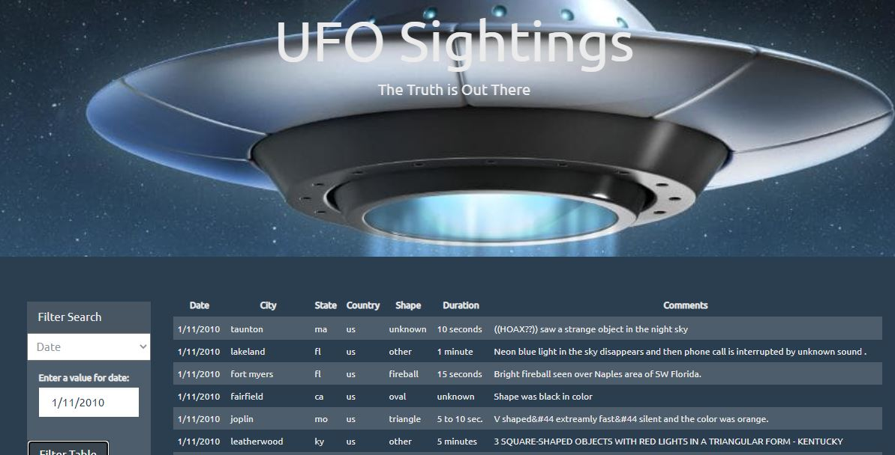

# Javascript Challenge

## Background

WAKE UP SHEEPLE! The extra-terrestrial menace has come to Earth and we here at `ALIENS-R-REAL` have collected all of the eye-witness reports we could to prove it! All we need to do now is put this information online for the world to see and then the matter will finally be put to rest.

There is just one tiny problem though... our collection is too large to search through manually. Even our most dedicated followers are complaining that they are having trouble locating specific reports in this mess.

That's why we are hiring you. We need you to write code that will create a table dynamically based upon a [dataset we provide](StarterCode/static/js/data.js). We also need to allow our users to filter the table data for specific values. There's a catch though... we only use pure JavaScript, HTML, and CSS, and D3.js on our web pages. They are the only coding languages which can be trusted.

You can handle this... right? The planet Earth needs to know what we have found!

### Level 1: Automatic Table and Date Search

* Used the UFO dataset provided in the form of an array of JavaScript objects, constructed a table to the web page that shows the numerous UFO sightings around the world filtered by a date.

### Level 2: Multiple Search Categories

* Allowed the user to select from additional search categories to filter down the results. Search categories include:

  1. `City`
  2. `State`
  3. `Country`
  4. `Shape`

- - -

### Dataset

* [UFO Sightings Data](StarterCode/static/js/data.js)
